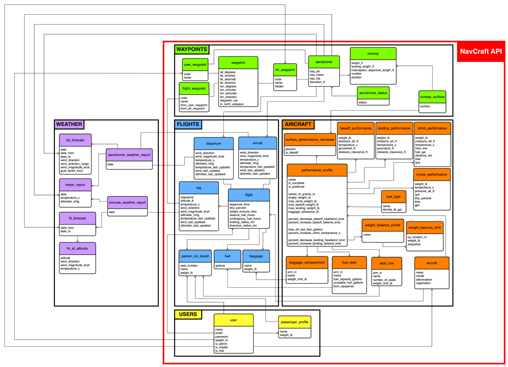

[](https://navbrixapi.com/docs)

_<center>_

### Improving the navigation briefing experience

[Motivation](#motivation) • [Quick Start](#quick-start) • [Usage](#usage) • [Contributing](#contributing)

</center>

NavBrix API enables [NavCraft API](https://github.com/AndresPradGo/navcraft-api) to work with weather forecasts and NOTAMs, from the Nav Canada weather briefing web app [CFPS](https://plan.navcanada.ca/wxrecall/).

- It connects to the NavCraft API's database and updates the flight plans' weather.

- It provides departure, arrival, enroute and alternate weather and NOTAM briefings.

# <a id="motivation"></a> 🌟 Motivation

NavBrix API was developed with one goal:

> Make the NavCraft API immune to weather changes.

NavCraft API makes the long and stressful task of flight planning, effortless. However, every time the weather changes, my flight plans break. Expecting a pilot to update the weather and NOTAM briefings and the departure, arrival and enroute weather data every time the weather changes, is unrealistic.

With NavBrix API, pilots don’t need to worry about outdated flight plan weather data.

# <a id="quick-start"></a> 🚀 Quick Start

The API is live. Navigate to the documentation on [navbrixapi.com/docs](https://navbrixapi.com/docs)

# <a id="usage"></a> 👨‍💻 Usage

If you use NavCraft API as the backend of your flight planning web, mobile or desktop app, you can enhance it with the NavBrix API. To call the Navbrix API endpoints, use the API’s URL, followed by the endpoint’s route. For example, to request a weather briefing for the flight with ID 352, you call:

```
https://navbrixapi.com/api/briefings/weather/352
```

In the [documentation](https://navbrixapi.com/docs), you can find a list of the exposed endpoints, with a brief description of what they do, and detailed schemas of the request and response data structures.

The data you need to provide in the request body may be extensive, but all of it can be extracted from the NavCraft API's `Get Flight` endpoint's response:

```
https://navcraftapi.com/api/flights/{flight_id}
```

##  API Architecture

Understanding the API’s architecture will help you navigate it better. NavBrix API was written using the Express Node.js library. The backbone of the API is divided into two main parts, its database and a directory of web scrapping classes.

###  The Database

As shown in the conceptual model diagram below, NavBrix API extends the NavCraft API's MySQL database, to include a Weather group.



The weather group is made up of two main entities:

1. The **aerodrome_weahter_report** entity stores the weather reports used to get the latest departure and arrival weather. That is, it holds a list of the latest _Terminal Aera Forecast (TAF)_ and _Meteorological Terminal Aviation Routine Weather Report (METAR)_ weather data, at the nearest aerodromes.

2. Similarly, the **enroute_weather_report** holds a list of the latest _METAR_ and _Forecast Winds and Temperatures Aloft (FD)_ weather data, at the aerodromes closest to the center of each enroute leg.

###  The Web Scraper

The data provided by NavBrix API has to be reliable like lives depend on it; because they do. [NAV Canada](https://www.navcanada.ca/en/) is the most reliable source when it comes to Canadian aviation publications. Unfortunately, NAV Canada has API options for businesses by data sales inquiry, but not a dedicated open API option for open source projects. Fortunately, NAV Canada does have a web tool that provides the data NavBrix API needs. The [CFPS](https://plan.navcanada.ca/wxrecall/) tool is live and open to the public.

Since querying a dedicated API wasn't an option, the second best option was web scrapping. NavBrix API uses a headless browser to query the CFPS web tool and scrape the weather reports and NOTAMs. The methods used to achieve this, are separated into four Javascript classes:

1. **The Scrapper** class uses the Node.js library Puppeteer, to run the headless browser and scrape the weather reports and NOTAMs.

2. **The Processor** class pre-processes the input data to the scraper and post-processes the output data, to organize it in Javascript objects.

3. **The Interpreter** class uses regular expressions to extract the required data from the weather reports.

4. **The Cleaner** class structures the extracted data in a clean format to input into the database and/or return it to the client.

# <a id="contributing"></a> 🤝 Contributing

Currently looking for help to work on the following features/issues, in order of urgency:

### 1. Issues 🐞

If you find a bug or a feature you want to implement, please raise an issue and submit a pull request. Your contributions are greatly appreciated.

### 2. Testing 

The first version of the NavBrix API does not have tests in place. However, The fact that the API relies on web scrapping, makes it susceptible to changes in external sources. To control this vulnerability, the API uses Typescript for strong type checking and Zod for input and output data validation. The next step to ensure a reliable behavior from the API, would be to use the [Vitest](https://vitest.dev/) library to unit test the methods of the four scraper classes.

If as part of implementing these tests, you consider refactoring the code is appropriate, your contributions are also welcome.

### 3. Interprete Reports 🕵️‍♂️

Aviation publications like weather reports and NOTAMs, have very specific structures. You can take advantage of this structure, to use regular expressions to extract specific information and use it to add more informative value to the briefings. A version of this is already being implemented in the **Interpreter** class of the API, but there's a lot of data yet to be extracted from NOTAMs and weather reports.

To work on this, you need to have a good understanding of how to use regular expressions and how to read NOTAMs and/or weather reports such us _TAFs_, _METARs_, _FDs_, _AIRMETs_ and _SIGMETs_.

When it comes to what data to extract from the reports you can use your imagination, but here are some ideas:

- **High-Level Upper Winds and Temperatures:**

  _FDs_ are divided into low and high levels. Low-level _FDs_ report from 3000 ft ASL up to 18,000 ft ASL every 3 to 6 thousand ft. Above 18,000 ft ASL is considered IFR territory and, since NavCraft API is for VFR flight plans, the high-level _FDs_ were not used for the first version of the API. Nonetheless, since the values for the "in-between" altitudes that are not reported are being estimated with linear regressions, extracting the high-level winds and temperatures may help with the linear regressions used to estimate the altitudes closer to the 18,000 ft limit.

- **Aerodrome Weather:**

  By extracting the clouds and visibility from _TAFs_ and _METARs_, you can report which aerodromes are under VFR, IFR or marginal VFR conditions. This information is very handy to include in the briefings.

- **_AIRMETs/SIGMETs'_ Airspace:**

  _AIRMETs_ and _SIGMETs_ include the coordinates of where the phenomenon is happening. Extracting these coordinates and sending them to the client, can help the client display the _AIRMETs_ and _SIGMETs_ in a map.

- **Label _NOTAMs_:**

  _NOTAMs_ inform pilots about a lot of different potential hazards. By identifying keywords like _obstacle_, _crane_, _fire_, _fuel not available_, _runway closed_, etc, you can put labels on the NOTAMs to categorize them.

Helpful resources:

- NAV Canada's Aviation Weather Service Guide - [download here](https://www.navcanada.ca/en/aeronautical-information/operational-guides.aspx)

- Transport Canada Aeronautical Information Manual - [download here](https://tc.canada.ca/en/aviation/publications/transport-canada-aeronautical-information-manual-tc-aim-tp-14371)

## 🛠 How to contribute

If you would like to work on any of the contributions mentioned above, follow the steps below.

> [!IMPORTANT]
> To run the code locally in development mode, you'll need to have [](https://docs.docker.com/get-docker/) installed on your machine.

### 0. Read the Open Source Guide 📑

This is an optional step, but a helpful one. If in doubt, follow the guidelines in the [Open Source Guide](https://opensource.guide/how-to-contribute/).

### 1. Browse the open issues 🔎

Check if someone else is already working on a similar feature. If there is an open issue you want to work on, and it hasn't been claimed, tag me in a comment to let me know you want to claim it.

If there is not an open issue related to the feature you want to work on, open a new one. Leave a detailed description of what you want to implement, and tag me on it. Add descriptive labels if appropriate.

### 2. Fork the repo 🔱

Once the issue has been assigned to you, set up the repository on your local machine.

- Fork the repository into your GitHub account.

- Clone the repo in your local machine.

  ```bash
  git clone https://github.com/<your_github_username>/navbrix-api.git
  ```

- Clone the NavCraft API repo in the same directory, you'll need its database to run the code.

  ```bash
  git clone https://github.com/AndresPradGo/navcraft-api.git
  ```

- Start a feature branch.

  ```bash
  cd navbrix-api
  git switch -c <feature_or_bugfix>/<feature_name>
  ```

### 3. Run the Docker container 

Once you've created a new feature branch, you can start working on the code. The repository has a `Dockerfile.dev` and `docker-compose.dev.yml` file to run in development mode:

- First, you can adjust the default environment variables of the project in the `docker-compose.dev.yml` file.

  | ENV_VARIABLE                        | SERVICE        | COMMENT                                                   |
  | ----------------------------------- | -------------- | --------------------------------------------------------- |
  | `MYSQL_ROOT_PASSWORD`               | _database_     | Database password.                                        |
  | `MYSQL_DATABASE`                    | _database_     | Name of the database.                                     |
  | `NAVCRAFT_API_DB_PASSWORD`          | _navcraft-api_ | Database password. Must equal `MYSQL_ROOT_PASSWORD`       |
  | `NAVCRAFT_API_DB_HOST`              | _navcraft-api_ | IP or domain where the database is running.               |
  | `NAVCRAFT_API_DB_NAME`              | _navcraft-api_ | Name of the database. Must equal `MYSQL_DATABASE`         |
  | `NAVCRAFT_API_MASTER_USER_NAME`     | _navcraft-api_ | Name of the master user to migrate into the database.     |
  | `NAVCRAFT_API_MASTER_USER_EMAIL`    | _navcraft-api_ | Email of the master user to migrate into the database.    |
  | `NAVCRAFT_API_MASTER_USER_WEIGHT`   | _navcraft-api_ | Weight of the master user to migrate into the database.   |
  | `NAVCRAFT_API_MASTER_USER_PASSWORD` | _navcraft-api_ | Password of the master user to migrate into the database. |
  | `NAVCRAFT_API_JWT_SECRET_KEY`       | _navcraft-api_ | Secret key used to sign and verify JWTs.                  |
  | `NAVCRAFT_API_JWT_ALGORITHM`        | _navcraft-api_ | Algorithm used to sign and verify JWTs.                   |
  | `NAVCRAFT_API_SENTRY_DSN`           | _navcraft-api_ | DSN used to track the project's issues on Sentry.         |
  | `DATABASE_URL`                      | _navbrix-api_  | Use `MYSQL_DATABASE` and `MYSQL_ROOT_PASSWORD`            |
  | `NAVBRIX_API_NAVCRAFT_API_URL`      | _navbrix-api_  | NavCraft API's URL, only used for the documentation.      |
  | `NAVBRIX_API_JWT_SECRET_KEY`        | _navbrix-api_  | Must equal `NAVCRAFT_API_JWT_SECRET_KEY`                  |
  | `NAVBRIX_API_JWT_ALGORITHM`         | _navbrix-api_  | Must equal `NAVCRAFT_API_JWT_ALGORITHM`                   |
  | `NAVBRIX_API_SENTRY_DSN`            | _navbrix-api_  | DSN used to track the project's issues on Sentry.         |

- Next, build the docker images and run the docker container:

  ```bash
  docker-compose -f docker-compose.dev.yml build
  docker-compose -f docker-compose.dev.yml up -d
  ```

- Finally, troubleshoot. If the docker container doesn't run properly on the first try, it's most likely due to a docker network problem, or because any of the ports are occupied.

  - First, try restarting the navcraft-api container, this will solve the network problem:

    ```bash
    docker restart navbrix-api-navcraft-api-1
    ```

  - If the container keeps crashing because a port is occupied, open the `docker-compose.dev.yml` file and adjust the mapped ports. The default ports are:

    | SERVICE        | CONTAINER PORT | MAPPED TO |
    | -------------- | -------------- | --------- |
    | _database_     | 3306           | 3307      |
    | _navcraft-api_ | 8000           | 8000      |
    | _navbrix-api_  | 3000           | 3000      |

- The three will run on the localhost `127.0.0.1` and their respective port. NavBrix API, for example, will run on:

  ```
  http://127.0.0.1:3000
  ```

> [!TIP]
> The `/src` directory in the host, is being mapped to the `/src` directory in the container. Thus, any changes you save will be automatically shared to the container. However, the `package.json` and `package-lock.json` files are not being mapped. If you install a new library, you'll need to rebuild the image for it to show in the container.

### 4. Submit a pull request 

After committing your code following commit best practices, you're ready to submit your changes.

- First, push the changes to your forked repo.

  ```bash
  git push origin <feature_or_bugfix>/<feature_name>
  ```

- Then, open a pull request to the `main` branch.
